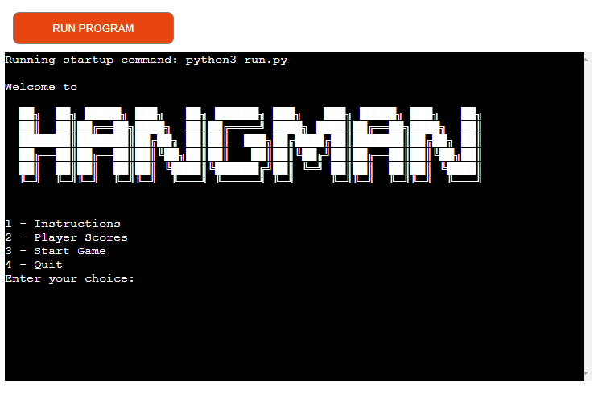
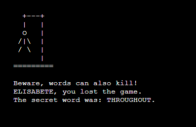

<h1>Hangman Game</h1>

Hangman is a very popular and traditional game that promotes literacy, quick thinking, vocabulary, and writing while having fun.

The object of the game is to discover the secret word by positioning the letters, and this must occur before the body is complete.

A dynamic, fast, and fun game that appeals to all generations, creating a special moment among friends or families.

Visit our page by clicking here:
<a href="https://hangman-game-project-af38dee50bde.herokuapp.com/"  target="_blank" rel=”noopener” >Hangman</a>

<h2>User Experience</h2>
<h3>User stories</h3>
<ul>
<li>First Time Visitor Goals</li>
<ul>
<li>As a first-time user, I want to easily understand the main goal of the game and how it works.</li>
</ul>
<ul>
<li>That the messages are clear, and the responsiveness works correctly.</li>
</ul>
<ul>
<li>That the content is not visually polluted and does not cause unexpected distractions, with correct spacing for better reading of the text.</li>
</ul>
</ul>
<ul>
<li>Returning Visitor Goals</li>
<ul>
<li>As a returning visitor, I would like to choose to play with someone else.</li>
</ul>
</ul>
<ul>
<li>Frequent User Goals</li>
<ul>
<li>As a frequent user, I would like to try to guess different levels.</li>
</ul>
</ul>

<h3>Flow Chart</h3>

<h2>Features</h2>

<h3>Responsiveness</h3>
<ul>
<li>Viewports</li>
<ul>
<li>Desktop 1600px x 992px</li>
<li>Laptop 1280px x 802px</li>
<li>Tablet 768px x 1024px</li>
</ul>
</ul>

<h3>Initial Page</h3>

<h3>Game Start</h3>
<ul>
<li>Simple and visible logo to greet the player and start the game.</li>
<li>The game starts asking which option to play, alone or with another player.</li>
</ul>

<h3>Letter Capture</h3>
<ul>
<li>Captures the letters entered by the player(s), if the letter is correct it goes to its correct space in the word order, if the letter is wrong the body starts to be inserted into the gallows.</li>
<li>If the game is between two players, after each move is taken in turns players.</li>
</ul>

<h3>Final Message</h3>
<ul>
<li>Final message with a funny sentence for either end (win or lose)</li>
</ul>

<h2>Technologies Used</h2>
<h3>Languages Used</h3>
<ul>
 <li>Python</li>
</ul>

<h3>Frameworks, Libraries & Programs Used</h3>
<ol>
</li>
<li> <a href="https://miro.com/" target="_blank" rel=”noopener”>Miro</a>
<ul>
<li>Miro was used to create the Flow Chart to facilitate the logic and construction of the game.</li>
</ul>
</li>
<li> <a href="https://github.com/" target="_blank" rel=”noopener”>GitHub</a>
<ul>
<li>GitHub is used to store the projects code after being pushed from Git.</li>
</ul>
</li>
<li> <a href="https://git-scm.com/" target="_blank" rel=”noopener”>Git</a>
<ul>
<li>Git was used for version control by utilizing the Gitpod terminal to commit to Git and Push to GitHub.</li>
</ul>
</li>
</li>
<li> <a href="https://www.heroku.com/" target="_blank" rel=”noopener”>Heroku</a>
<ul>
<li>To deploy the project.</li>
</ul>
</li>
<li> <a href="https://pep8ci.herokuapp.com/#" target="_blank" rel=”noopener”>CI Python Linter</a>
<ul>
<li>To detect coding issues.</li>
</ul>
</li>
</ol>

<h2>Testing</h2>
<h3>Testing User Stories from User Experience (UX) Section</h3>

<ul>
<li>As a user, I want to be able to interact to get the words right.</li>
<li>As a user, I want a site that is intuitive and easy to navigate.</li>
<li>As a user, I want the site to challenge me to improve my thinking.</li>
</ul>

<h3>Manual Testing</h3>

The manual test was done on a self-built desktop with an HP Pavilion Gaming Laptop, 16.1", Windows 10 Home, Intel® Core™ i5, 8GB RAM, 1TB HDD, NVIDIA® GeForce® GTX 1650 Ti

| Feature tested | Expected result                                    | Current results | Approved disapproved |
| :---           |     :---:                                          |      :---:      |                 ---: |
| Capturing user's handwriting  |   Collecting handwriting entered by the user                          |   as expected   | To spend             |
| Captured correct letter    |  Entered letter in the correct space in the word order        |   as expected   | To spend             |
| Captured wrong letter           |   Part of hangman body inserted with symbols |   as expected   | To spend             |
| Letter entry allowed until the word is completed or the entire body hangs| Show completed word or whole body hanging   |   as expected   | To spend             |
| Final message|  Congratulates user, informs you if you won or lost with a funny message|   as expected   | To spend             |
 

<h3>Browser Test</h3>

| Browser Tested  | Work Status        |
| ----------------|--------------------|
| Microsoft Edge  |  Works as expected |
| Chrome          |  Works as expected |
| Firefox         |  Works as expected |

 
<h3>Device Test</h3>

| Browser Tested              | Work Status        |
| ----------------------------|--------------------|
| Huawei Y5                   |  Works as expected |
| Honor Lit 20                |  Works as expected |
| Samsung Galaxy A12          |  Works as expected |
 

<h3>Improvements to be Implemented</h3>
<ul>
<li>Insert Intermediate and Advanced Levels Sections</li>
</ul>

<h3>Known Bugs</h3>
<ul>
<li>No bugs known</li>
</ul>

<h2>Deployment</h2>
<h3>GitHub</h3>

<h4></h4>
<ol>
<li>In the GitHub body of my page, click the menu button: repository;</li>
<li>Locate the portfolio01 project and click;</li>
<li>Click on the button: settings;</li>
<li>Click on the button: pages;</li>
<li>Click on the button: visit the site.</li>

</ol>
<h4>Cloning the GitHub Repository</h4>
<ol>
<li>On GitHub.com, navigate to the main page of the repository.</li>
<li>To clone your repository using the command line using HTTPS, under "Quick setup", click in copying.  To clone the repository using an SSH key, including a certificate issued by your organization's SSH certificate authority, click SSH, then click in copying.</li>
<li>Open Git Bash.</li>
<li>Change the current working directory to the location where you want the cloned directory.</li>
<li>Type git clone, and then paste the URL you copied earlier.</li>
<li>Press Enter to create your local clone.</li>
</ol>

<h2>Credits</h2>
<h3>Code</h3>

<ul>
<li> <a href="https://codeinstitute.net/ie/" target="_blank" rel=”noopener”>Code Institute</a>
<ul>
<li>README references.</li>
</ul>
</li>
<li> <a href="https://stackoverflow.com/" target="_blank" rel=”noopener”>Stack Overflow</a>
<ul>
<li>Code reference.</li>
</ul>
</li>
<li>Readme initial artwork </li> 
<ul>
<li>Designed and thought of by the developer of this project.</li>
</ul>
<li><a href = "https://textkool.com/" target = "_blank" rel="noopener">Text Kool</a>
<ul>
<li>ASCII text art generator</li>
</ul>
</li>
<li><a href = "https://www.youtube.com/watch?v=JNXmCOumNw0" target = "_blank" rel="noopener">
CBT Nuggets
</a>
<ul>
<li>Code reference</li>
</ul>
</li>
<li><a href = "https://www.youtube.com/watch?v=wmSysRui0cI" target = "_blank" rel="noopener">
MJ Codes
</a>
<ul>
<li>Code reference</li>
</ul>
</li>
</ul>

<h3>Content</h3>
<ul>
<li>Words thought up at random by the developer of this project.</li>
</ul>

<h2>Acknowledgements</h2>
<ul>
<li>I thank the entire Code Institute team for their understanding with all the challenges that occurred along this project. I thank my family for always being my support.</li>
</ul>

